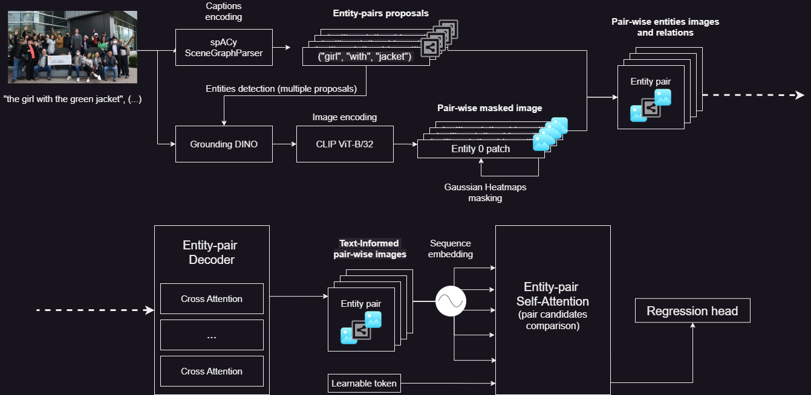

# Visgator
Referring expressions visual grounding wih scene graphs and object detection.

## Table of contents
- [Setup](#setup)
- [Models](#models)
  1. [Baseline: YoloCLIP](#yoloclip)
  2. [SGG](#sgg)
  3. [ERP-Attention](#erpa-preview)
- [Proposed solution](#architecture)
  1. [Preprocessing](#preprocessing)
  2. [Instantiation](#instantiation)
  3. [Decoding](#decoding)
  4. [ERP-Attention](#erpattention)
- [Framework](#framework)
  1. [Data processing](#data)
  2. [Training logic](#training)
  3. [Optimization](#optimization)
  4. [Evaluation](#evaluation)

## <a name="setup"></a> Setup
A summary script to configure a Ubuntu-based server for training can be found [here](azure_setup.sh).
To run an instance locally:
```
git clone https://github.com/FrancescoGentile/visgator
cd visgator && pip install -e .
# alternatively: cd visgator && pdm install
python -m visgator --phase generate --config config/example.yaml
python -m visgator --phase train --config config/example.yaml
python -m visgator --phase eval --config config/example.yaml
```

## <a name="models"></a> Models
We report the accuracies achieved with multiple architectures for referring expression visual grounding. YOLO-CLIP is considered as baseline.
| Architecture | IoU | Generalized IoU | Accuracy @50 | Accuracy @70 | Accuracy @90 |
|---|---|---|---|---|---|
| Baseline |   |   |   |   |   |
| SGG |   |   |   |   |   |
| ERP-Attention |   |   |   |   |   | 

### <a name="yoloclip"></a> YOLO-CLIP (baseline)
The simplest model used as reference is a [combination of YOLO and CLIP](https://github.com/FrancescoGentile/visgator/blob/develop/src/visgator/models/yoloclip/_model.py):
- Given an image, a YOLOv5 object detector extracts the bounding boxes and classes for all the recognized entities.
- Each bounding box is encoded with the visual encoder of CLIP (default: ResNet50, tested also with ViT-B/32) and projected to the CLIP text+image space.
- The image caption is encoded with the CLIP transformer backbone and projected to the CLIP text+image space.
- Finally, the bounding box with the highest CLIP score (caption embedding / bbox patch embedding) is returned.

### <a name="sgg"></a> Scene Graph Grounder (SGG)
As a variant of ERP-Attention, the [Scene Graph Grounder](https://github.com/FrancescoGentile/visgator/blob/develop/src/visgator/models/erpa/_model.py) model follow the stages:
- Each image caption is converted to a [SceneGraph](https://en.wikipedia.org/wiki/Scene_graph) with detected entities and relationships.
- Given an image, a detector (e.g. GroundingDINO) extracts a set of bounding boxes for each entity identified in the SceneGraph.
- For each set of entities involved in a relationship, the image is masked with joint gaussian heatmaps centered on the detected visual instances. 
- A Decoder computes the cross-attention between the CLIP-encoded image patches and the CLIP-encoded entity-relationship-entity tuple.
- A learnable token processed by the Decoder is processed by a regression head, returning the normalized bounding box parameters through a sigmoid activation.

### <a name="erpa-preview"></a> Entities Relationship Pairs Attention (ERP-A)
With respect to a Scene Graph Grounder, the ERP-Attention architecture adds a final stage: 
- All the entity-relationship-entity (ERP) tuples are encoded as informed visual token sequences from the Decoder.
- A stack of global self-attention layers processes the concatenated ERP sequences along with a learnable token. A sequence-wise (ERP) positional encoding accounts for different tuples.
- The output corresponsponding to the learnable token is processed by a regression head to predict the normalized target bounding box.

Further details on the implementation and processing follow in the next section.

## <a name="architecture"></a> Proposed solution


For each training sample (image, caption):
1. Identify all the Entity-Relationship-Pairs (ERP) from the caption ([Preprocessing](#preprocessing))
2. Given multiple portions of the image as detected candidates for each entity, instantiate an ERP for all the combination of the visual candidates of each entity ([Instantiation](#instantiation)).
3. Enrich each entity-pair (a sequence of visual tokens) with the token embeddings from the parsed caption through cross-attention ([Decoding](#decoding)).
4. Attend to all the ERP sequences (each is a sequence of text-informed visual tokens) in addition to a learnable regression token and project this to predict the final bounding box ([ERP-Attention](#erpattention)).

### <a name="preprocessing"></a> 1. Preprocessing
The dataset is initially pre-processed to expand captions to [SceneGraphs](https://en.wikipedia.org/wiki/Scene_graph). With `visgator.datasets.refcocog._generator.Generator.generate()`, each image annotation is parsed through a `visgator.utils.graph.SpacySceneGraphParser` ([reference](https://github.com/vacancy/SceneGraphParser)): entities and relationships between them are identified and stored in a graph object. The generator encodes each dataset sample as a tuple of `(image_path, caption, graph)`.

```python -m visgator --phase generate --config config/example.yaml```

The generated annotations file for RefCOCOg in UMD format:
```{
  "test": [
    {
      "image": "COCO_train2014_000000380440.jpg",
      "caption": {
        "sentence": "the man in yellow coat",
        "graph": {
          "entities": [
            {
              "span": "the man",
              "head": "man"
            },
            {
              "span": "yellow coat",
              "head": "coat"
            }
          ],
          "relations": [
            {
              "subject": 0,
              "predicate": "in",
              "object": 1
            }
          ]
        }
      },
      "bbox": [
        374.31,
        65.06,
        136.04,
        201.94
      ]
    },
    ...
  ]
}
```

### <a name="instantiation"></a> 2. Instantiation
Each `(image, caption)` pair is encoded with respectively the vision and the text backbone of CLIP (ViT-B/32). Note that the final projections leading to the common embedding space are discarded (`visgator.models.erpa._model.forward()`). 

In parallel, each `(image, caption)` pair is also processed with [GroundingDINO](https://github.com/IDEA-Research/GroundingDINO), implemented with `visgator.models.erpa._detector.Detector`, to generate region proposals for each entity (`visgator.models.erpa._misc.Graph.new()`). 

The per-entity region proposals, the text embeddings and the caption are embedded in a Nested SceneGraph, that is a set of graphs for the training batch. Moreover, the padded region proposals are organized in `visgator.utils.bbox.BBoxes` objects to apply handy geometrical operators.
Finally, a `NestedGraph` object is passed to the ERP-Decoder, along with the formatted bounding boxes and the image embeddings.

### <a name="decoding"></a> 3. Decoding

In each ERP, a gaussian heatmap is computed for each entity bounding box. The union of the heatmaps constitutes the mask for the input image (`visgator.models.erpa.Decoder.forward()`). A stack of attention layers processes the ERPs so that the visual tokens attend the text embeddings, eventually re-arranged in nodes and edges of the NestedGraph. 

### <a name="erpattention"></a> 4. ERP-Attention
The batch NestedGraph is eventually processed by the `visgator.models.erpa._head.RegressionHead`: each ERP token sequence is summed to a positional encoding (sequence-wise). A stack of self-attention layers attends to the sequence of concatenated ERPs, in addition to a learnable token. The latter is eventually projected linearly to predict the target bounding box (`visgator.models.erpa._head.RegressionHead.forward()`). 


## <a name="framework"></a> Framework

### <a name="data"></a> Data processing
A `visgator.datasets._dataset.Dataset` is a general class representating a dataset instance. In our implementation, a set of `BatchSample` (image, caption, SceneGraph) and corresponding `BBoxes` (supporting object-wise geometric operations) are returned.
```
    @staticmethod
    def batchify(batch: list[tuple[BatchSample, BBox]]) -> tuple[Batch, BBoxes]:
        samples = tuple(sample for sample, _ in batch)
        bboxes = [bbox for _, bbox in batch]
        return Batch(samples), BBoxes.from_bboxes(bboxes)
```
A `visgator.datasets.refcocog._generator.Generator` (in this case specific to the RefCOCOg dataset) is a module dedacted to the extraction of SceneGraphs from each image caption, written to an annotation file to use at training time.
```
  def generate(self) -> None:
      split_samples = get_preprocessed_samples(
          self._config,
          [Split.TRAIN, Split.VALIDATION, Split.TEST],
      )

      parser = SpacySceneGraphParser()

      output: dict[str, list] = {}  # type: ignore
      for split, samples in split_samples.items():
          split_output: list[dict] = []  # type: ignore
          output[str(split)] = split_output

          for sample in tqdm(samples, desc=f"Generating {split} split"):
              graph = parser.parse(sample.caption.sentence)
              new_sample = {
                  "image": sample.path.name,
                  "caption": Caption(sample.caption.sentence, graph).to_dict(),
                  "bbox": sample.bbox,
              }
              split_output.append(new_sample)

      output_path = (
          self._config.path / f"annotations/info_{self._config.split_provider}.json"
      )
      with open(output_path, "w") as f:
          json.dump(output, f, indent=2)
```

### <a name="training"></a> Training logic


### <a name="optimization"></a> Optimization


### <a name="evaluation"></a> Evaluation


